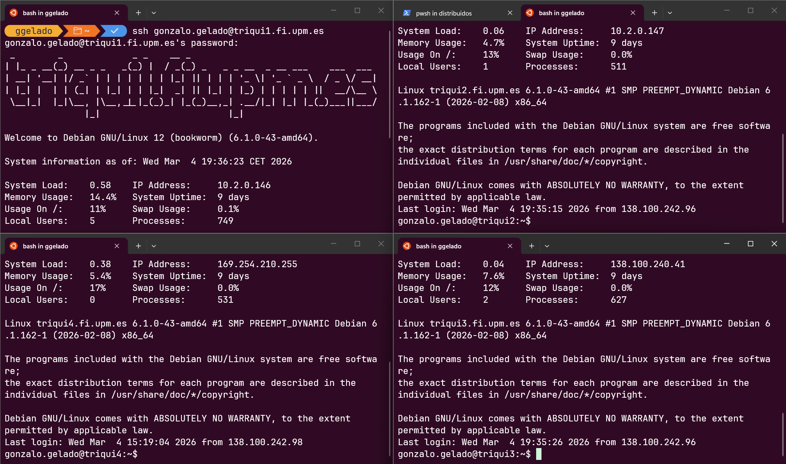
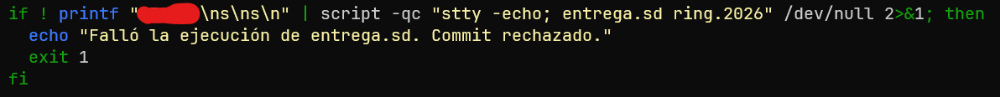

## Documentación

- Estas diapositivas: https://ggelado.github.io/diaposDistribuidos/diapos.pdf
- En documento para leer: https://ggelado.github.io/diaposDistribuidos/documento.docx

Este documento está en redacción, cada cambio actualiza los ficheros en esos enlaces.

Consulta regularmente la última versión en esos enlaces.

# Introducción

## ¿De qué va esto?

Va de que los 4 nodos de triqui (p.ej.) hablen entre ellos, se manden ficheritos, mensajitos y demás, pero que ninguno sea un servidor, **TODOS SON SERVIDORES Y CLIENTES**.

Eso es el P2P (lo que se hacía hace años con los torrents ilegales).

Ya lo iremos definiendo sobre la marcha.

## ¿Qué necesito?

- Entorno linux:
  
  - WSL
  
  - Máquina Virtual
  
  - Linux nativo
  
  - ¿Triqui? ¿Escritorios virtuales? (si tu paciencia y cordura lo permiten)

- Conexión con triqui

- Usar el Gestor de Entregas de Triqui (ya explicaré cómo funciona)

## ¿Empezamos?

1. Coge un editor cómodo (vas a dedicarle un ratito)
   
   - VSCode
   
   - CLion
   
   - ¿Nano? ¿vi? ¿emacs?

2- Pon tu entorno de trabajo

3- Enciende la VPN

# Arrancando

## Ficheros de Trabajo

Ejecuta en una terminal

```bash
wget https://laurel.datsi.fi.upm.es/_media/docencia/asignaturas
/sd/ring-2026.tgz
# 2 líneas para que no se corte
tar xvfz ring-2026.tgz
cd DATSI/SSDD/ring.2026/src/
```

De una

## Comunicación con Triqui

Vas a pasar muchas veces ficheros de triqui a tu ordenador y viceversa, puedes hacer SCP todo el rato, pero vas a deprimirte.

- [Bitvise](https://bitvise.com/ssh-client-download) (Mi preferido para Windows)

- [Uso Ubuntu nativo](https://itsupport.cs.uvic.ca/tutorials/linux_sftp/#:~:text=SFTP%20using%20Linux%20GUI%20File%20Browser%20(Nautilus))

O si no...

```bash
scp ficheroOrigen usuario@triqui.fi.upm.es:
~/DATSI/SSDD/ring.2026/src/

# 2 líneas para que no se corte
```

Usa esos programas, por favor, te salvan la vida.

## Gestor de Entregas

Funciona igual que en SSOO:

**ADVERTENCIA**: Por alguna razón el Gestor espera que los ficheros estén en `~/DATSI/SSDD/ring.2026/` pero los profes han puesto el código de la plantilla en `todoEso/src`, por lo que **falla**. Saca los ficheros de src y llévalos a esa carpeta.

Con Bitvise y demás es sencilla la operación.

## Gestor de Entregas (2)

Cada vez que queramos hacer una entrega:

1. Entrar en triqui

2. Poner **DONDE SEA** (en una terminal): `entrega.sd ring.2026`

3. Introducir el número de matrícula cuando se solicite

4. El corrector corre cada 3h y manda un correo

# A picar código

## ¿Dónde se toca?

- ring_cln.c

- ring_srv.c

- common.c

- include/common.h

Y ya está, el resto de ficheros se miran pero no se tocan.

## ¿Cómo empiezo?

Pues por el principio.

No empieces a leerte todo el enunciado, vamos por partes:

# Fase 1 - Paso 1

## Desplegar parte servidora

Vamos con el fichero `ring_cln.c`. 

**Objetivo**: 

- Debe guardar la información recibida en sus parámetros e implementarse la función ring_self a partir de ella.
- Debe crear el socket de servicio, para lo que puede usar la función create_socket_srv, tal como se hace en el ejemplo propuesto. Esa función devuelve el puerto seleccionado por el sistema operativo en formato de red, que, a su vez, debe ser devuelto por esta función.
- Debe crear el *thread* de servicio que ejecutará la función server_thread de ring_srv.c pasándole como argumento el socket de servicio. Para ello, puede usar la función create_thread de common.c, que crea un *thread* de tipo *detached*.

## ¿Qué tenemos?

Nos dan esto

```c
// inicia el nodo añadiéndolo a la red P2P si ya está creada;
// los puertos e IPs deben estar en formato de red;
// debe devolver en el último parámetro el puerto reservado en formato red;
// retorna 0 si OK y -1 si error
int ring_init(const char *shrd_dir, unsigned int local_ip, unsigned int remote_ip, unsigned short remote_port, unsigned short *alloc_port) {
    if (initialize()) return -1; // ya está inicializada
    return 0;
}
```

Hay params de **salida** (punteros):

- `unsigned short *alloc_port` es de **salida**

## Debe guardar la información recibida en sus parámetros

Pues vamos a hacer eso, eso es sencillo.

Variable arriba y listo:

```c
shared_dir_copia = strdup(shrd_dir);
ip_copia = local_ip;
```

`strdup` para copiar los *Strings*.

## e implementarse la función `ring_self` a partir de ella.

```c
int ring_self(unsigned int *ip, unsigned short *port)
```

Son parámetros de salida (punteros), ya sabes cómo va

```c
if (!is_initialized()) return -1; // no está inicializada
*ip = ip_copia;
// *port = port_copia; // ni caso, ya lo veremos
return 0;
```

# Primer párrafo superado

## Debe crear el socket de servicio, para lo que puede usar la función **create_socket_srv**, tal como se hace en el ejemplo propuesto.

¿Qué ejemplo?

Pues este

```c
int main(int argc, char *argv[]) {
    int s, s_conec;
    unsigned int addr_size;
    unsigned short port;
    struct sockaddr_in clnt_addr;

    // inicializa el socket y lo prepara para aceptar conexiones
    if ((s=create_socket_srv(&port)) < 0) return 1;
    printf("Reservado el puerto %d\n", ntohs(port));
```

Ejemplo: `server.c`

## Vamos con ello, a copiar sin piedad

```c
if ((s=create_socket_srv(&port_copia)) < 0) return 1;
```

(por cierto, ya tenemos el valor de retorno de `*alloc_port`)

Ya podemos completar en ring_self

(además, recuerda que tienes que guardar ese puerto en alguna variable)

## Debe crear el *thread* de servicio que ejecutará la función server_thread de ring_srv.c pasándole como argumento el socket de servicio. Para ello, puede usar la función create_thread de common.c, que crea un *thread* de tipo *detached*.

¿Cómo? ¿Qué pone ahí?

Poco a poco, no nos asustemos:

Vamos a buscar el ejemplo ese que dice, a ver si vemos algo.

Por cierto, ahí te lo dice pero... es en `ring_srv.c`.

## A ver el ejemplito

```c
while(1) {
    addr_size=sizeof(clnt_addr);
    // acepta la conexión
    if ((s_conec=accept(s, (struct sockaddr *)&clnt_addr, &addr_size))<0){
        perror("error en accept"); close(s); return 0;
    }
    printf("conectado cliente con ip %s y puerto %u\n",
            inet_ntoa(clnt_addr.sin_addr), ntohs(clnt_addr.sin_port));
    // crea el thread de servicio pasándole el argumento por valor
    create_thread(request_handler, (void *)(long)s_conec);
}
close(s); // cierra el socket general
```

Pues ya sabes, A COPIAR SIN PIEDAD

PD: Lo de formato de red se encargan `inet_ntoa` y `ntohs` (esto es de SSOO, pero no hace falta, tú copia y no preguntes).

## Debe crear el *thread* de servicio

```c
create_thread(
```

## que ejecutará la función server_thread de ring_srv.c

```c
create_thread(request_handler
```

## pasándole como argumento el socket de servicio

```c
create_thread(request_handler, (void *)(long)s_conec);
```

Si es que es calcado, literalmente, **COPIA LO QUE VIENE EN EL EJEMPLO**.

## Nos vamos al código

```c
// función para el thread que implementa la funcionalidad de servidor
// debe recibir como argumento el socket de servicio
void *server_thread(void *arg){
    return NULL;
}
```

y a hacer lo mismo.

Acuerdate de dar de alta variables y demás para que compile, y que en vez de retornar 0 retornamos NULL (es `void`), PERO EL RESTO IGUAL.

## Prueba del Paso 1

```bash
mkdir dir1 && ./ring dir1
```

En otra terminal:

```bash
ss -tap | grep <puerto>
# debe aparecer LISTEN con el PID de ring
```

# Fase 1 - Paso 2

## Primera operación remota

**Objetivo**: que un nodo le pregunte el PID a otro.

Sin parámetros de entrada, devuelve un `int`.

## Códigos de operación

Antes de enviar nada hay que decirle al servidor **qué quieres**. Opciones:

- Carácter: `'P'`
- Entero: `0`
- String: `"GETPID"`

El `char` y el entero son los más cómodos para `switch` (en C no podemos hacerlo con un string).

## Parte cliente: `ring_remote_pid`

```c
char op = 'P';
send(s, &op, sizeof(char), 0);

int pid;
recv(s, &pid, sizeof(int), MSG_WAITALL);
close(s);
return ntohl(pid);
```

## Conectar con IP y puerto en formato de red

`create_socket_cln` espera strings. Aquí tenemos enteros en formato red:

```c
struct sockaddr_in addr;
addr.sin_family      = AF_INET;
addr.sin_addr.s_addr = remote_ip;  // formato red
addr.sin_port        = remote_port; // formato red

int s = socket(PF_INET, SOCK_STREAM, IPPROTO_TCP);
connect(s, (struct sockaddr *)&addr, sizeof(addr));
```

Este esquema se repite.

## Parte servidora

```c
char op;
recv(soc, &op, sizeof(char), MSG_WAITALL);

switch(op) {
    case 'P': {
        int pid = htonl(getpid());
        write(soc, &pid, sizeof(int));
        break;
    }
}
close(soc);
return NULL;
```

## Prueba del Paso 2

```bash
./ring dir1
# pulsa P, introduce la IP y puerto del propio nodo
```

```
PID 2576024
```

Debe coincidir con el PID del mensaje de bienvenida.

# A currar

## Haz funcionar esto



# Avanzado

Esto es algo adicional, no es puramente de la práctica, y puedes omitirlo directamente, pero si utilizas git, y tienes algo de destreza, puede llegar a ser muy cómodo:

## Entregando con git push

¿Sabías que triqui puede ser un servidor git?

Sí, no solo GitHub y GitLab son servidores git. Puedes crear un servidor git del siguiente modo:

1. Ubica en triqui el directorio `~/DATSI/SSDD/ring.2026`

2. Da de alta un repositorio (ya sabes, `git init`. Recuerda que las ramas deberían llamarse igual para evitar problemas más adelante, aunque no es fundamental.)

3. Regístralo como `origin` en tu carpeta de trabajo.

## Agregando orígenes a git

Tienes 2 opciones: Solo usar triqui como origen, o usar tanto triqui como github.

- `git remote add [nombre] [url]`

Donde `url` es `ssh://usuario@triqui1.fi.upm.es` `/homefi/alumnos/rutaHOME` `/DATSI/SSDD/ring.2026`

Recuerda consultar la ruta completa con el mandato

```bash
pwd
```

Puedes llamar al remote origin, o simplemente algo como triqui (tendrás que hacer `git push triqui`)

## Push combinado

```bash
git remote add origin https://repo1.git # p.ej. github
git remote set-url --add --push origin # url triqui de antes
```

Nota: Es posible que tengas que configurar el upstream

```bash
git push --set-upstream origin main # o master
```

## Entrega automatizada

La gracia de todo esto es que puedas entregar de forma automática al hacer push. Para ello:

1. Accede a `~/DATSI/SSDD/ring.2026/.git/hooks`

2. Crea un fichero `post-receive` 

Ese fichero será un script bash con instrucciones a ejecutar cada vez que reciba un push. En nuestro caso, queremos que corra el script de entrega:

## Post-receive hook

```bash
#!/bin/bash
set -euo pipefail
cd "/homefi/alumnos/TUHOME/DATSI/SSDD/ring.2026"
```



La parte roja sustitúyela por tu número de matrícula (`numMat\ns\ns\n`)

Eso lo que hace es seguir los pasos del corrector:

1. Número de matrícula.

2. Confirmar entrega.

3. Sobrescribir entrega.
